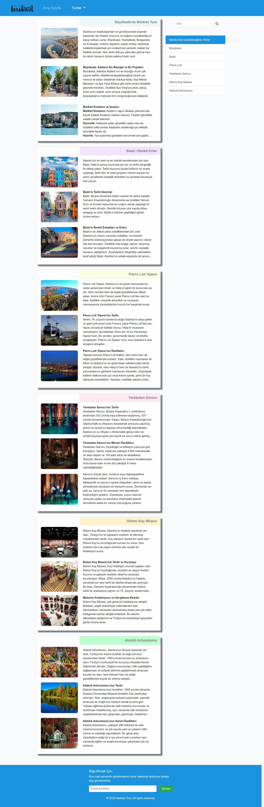

# :world_map: Blog Sitesi Projesi | Istanbul Tour

[🇬🇧 İngilizce README.md için tıklayın](./README.md)

*Oluşturulma Tarihi: 17 Şubat 2025*

* Bu proje, Patika Frontend Bootcamp'i için oluşturulan **Hafta-3 / Ödev-1 / Blog Sitesi** projesidir. 
* [Hafta-2 / Ödev-1 / Blog Sitesi](https://github.com/tunahanyasar/blog-page-istanbul-tour.git)'nin bootstrap ile geliştirilmiş halidir.
* **Bootstrap 4** alıştırması için bir pratik projesidir.
* **HTML**, **CSS**, **Bootstrap 4** kullanılmıştır.
* Sayfanın style özellikleri **bootstrap 4** kullanılarak hazırlanmıştır.

---

## 🌐 Canlı Demo

Canlı web sitesini ziyaret edin: [Istanbul Tour Blog Bootstrap](https://blog-istanbul-tour-bootstrap.vercel.app/)

---

## :computer: Kurulum ve Kullanım

1. Projeyi klonlayın:
```bash
git clone https://github.com/tunahanyasar/blog-istanbul-tour-bootstrap.git
```

2. Proje dizinine gidin:
```bash
cd blog-istanbul-tour-bootstrap
```

3. `index.html` dosyasını bir web tarayıcısında açın.

---

## 📜 Sayfa Yapısı

:open_file_folder: **Klasörler;**
* *index.html* - Ana sayfa
* *post.html* - Turlar sayfası
* *style.css* - Özel stil dosyası
* *img/* - Blog görselleri
* *img-page/* - README görselleri

### Ana Sayfa (index.html)
1. **Header ve Navigasyon**
   - Dropdown menü ile tur kategorileri

2. **Jumbotron ve Carousel**
   - Bootstrap jumbotron ile dikkat çekici başlık alanı
   - Otomatik geçişli carousel ile öne çıkan turlar

3. **İçerik Bölümü**
   - 6 adet tur kartı
   - Her kartta tur özeti ve görsel
   - Detay sayfasına yönlendirme linkleri

4. **Sidebar**
   - Tur başlıklarına hızlı erişim
   - Sayfa içi navigasyon

### Turlar Sayfası (post.html)
1. **Detaylı Tur Bilgileri**
   - Her tur için kapsamlı açıklamalar
   - Yüksek çözünürlüklü görseller
   - Tur özellikleri ve fiyatlandırma

2. **Sticky Sidebar**
   - Sayfa kaydırıldığında sabit kalan navigasyon
   - Kolay erişilebilir tur başlıkları

---

## :star2: Öne Çıkan Özellikler


1. **Bootstrap 4 Entegrasyonu**
   - Grid sistemi
   - Hazır UI elementleri

2. **Kullanıcı Deneyimi**
   - Sticky sidebar ile kolay navigasyon
   - Carousel ile görsel zenginlik
   - Dropdown menüler ile organize içerik

---

## 💡 Kullanılan Teknolojiler

**Frontend:**
* HTML5
* CSS3
* Bootstrap 4
  - Grid Sistemi
  - Navbar
  - Jumbotron
  - Carousel
  - List-group
  - Cards

---

## :paperclip: Ekran Görüntüleri

### Ana Sayfa


### Turlar Sayfası


---

## 🎯 Proje Hedefleri

1. **Kullanıcı Deneyimi**
   - Sayfalar arası kolay gezinme
   - Net tur bilgisi sunumu
   - Tüm cihazlar için responsive tasarım

2. **İçerik Organizasyonu**
   - İyi yapılandırılmış tur bilgileri
   - Mantıksal içerik hiyerarşisi
   - Detaylı tur sayfalarına kolay erişim

3. **Teknik Başarılar**
   - Bootstrap 4 entegrasyonu
   - Modern web tasarım teknikleri
   - Responsive ve erişilebilir tasarım

---

## 📞 İletişim

[Tunahan Yaşar](https://github.com/tunahanyasar)

* GitHub: [@tunahanyasar](https://github.com/tunahanyasar)
* LinkedIn: [Tunahan Yaşar](https://www.linkedin.com/in/tunahan-yasar/)

